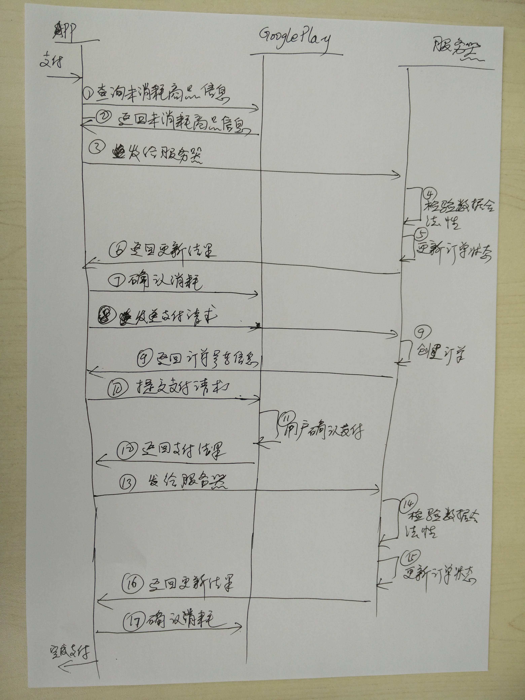

#Google play 支付流程

参考代码：android-sdk\extras\google\play_billing\samples\TrivialDrive\src\com\example\android\trivialdrivesample\util\IabHelper.java

###Google play支付的丢单原因：

丢单因为主要是因为支付操作都是在客户端完成的，非常容易受到网络等因素的影响，造成互相通信失败。比如：用户确认支付后，把请求提交给google play,可能因为网络不好造成，客户端没有接收到支付成功能消息（但有可能已经支付成功了，只是没收到支付结果而已）；还有客户端把支付结果通知给apus服务器时，也有可能因丢包等问题造成通知失败。

支付流程如下图所示：

流程说明：

1. 未确认消耗的商品（参考：IabHelper.queryPurchases()方法）；
2. 获得未确认消耗的商品信息；
3. 将商品信息发送给服器（把Purchase中的getOriginalJson()和getSignature()两项数据发给服务器就可以了）；
4. 服务器检查数据的合法性（参考IabHelper中的：Security.verifyPurchase(mSignatureBase64, purchaseData, dataSignature)）；
5. 更新订单状态（如果订单已经是支付的就不需要更新了）
6. 返回订单状态
7. 确认消耗（只有当服务器返回的订单状态，是支付成功才进行确认消耗，否则不进行确认消耗操作）
8. 发送创建订单请求给服务器；

    这步才开始正式的支付操作，前面的操都是为了解决丢单的问题，进行补更数据。
9. 返回订单号等信息
10. 提交支付请求到google play; 
11. 用户完成确认支付；
12. 返回支付结果信息；
13. 发送支付信息给服务器（与第三步相同）
14. 与第4步相同
15. 与第5步相同
16. 与第6步相同
17. 与第7步相同

如果有未确认消耗的商品，在第10步操作时是会报错的，所以1到7点是必须要完成的。

以上流程把支付和补丢单的流程混在一起了,显得有点长，大家可以根据自己的情况，做些优化，这里只是给出如果防止丢单的解决思路。

大家不要直接使用IabHelper.java中的代码，最好是根据自己重新开发。

这个流程也让我想到在“分布式系统”中，达到数据最终一致性的问题。这其实也一个不错的方案。避免了“分布式事务”，同时也能到过数据最终一致性。

使用apple stroe 支付的流程和Google play流程其实是样的，也会有丢单的问题，解决思路也是一样。
每次支付时，查询交易队列中，是否还有未完成的交易，如果有则进行补数据流程，最进行“完成交易”操作。
获得到apple stroe 支付结果后，提交给服务器，只有当服务器更新订单状态成功，才进行“完成交易”操作